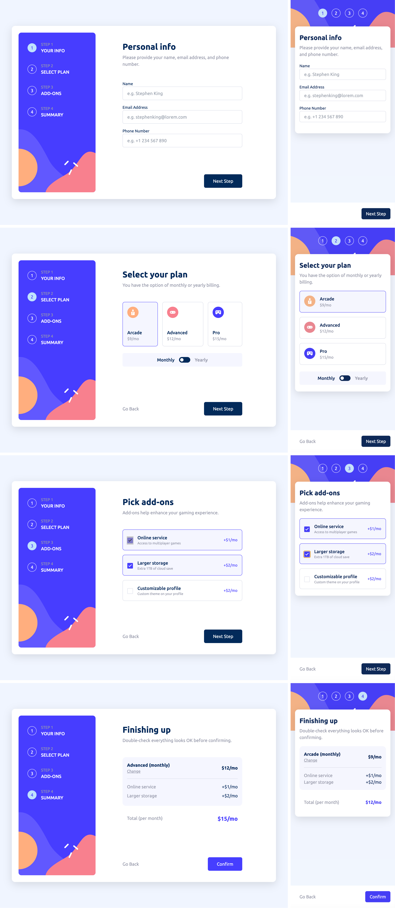

# Frontend Mentor - Multi-step form solution

This is a solution to the [Multi-step form challenge on Frontend Mentor](https://www.frontendmentor.io/challenges/multistep-form-YVAnSdqQBJ). Frontend Mentor challenges help you improve your coding skills by building realistic projects.

## Table of contents

- [Overview](#overview)
  - [The challenge](#the-challenge)
  - [Screenshot](#screenshot)
  - [Links](#links)
- [My process](#my-process)
  - [Built with](#built-with)
  - [What I learned](#what-i-learned)
- [Author](#author)

## Overview

### The challenge

Users should be able to:

- Complete each step of the sequence
- Go back to a previous step to update their selections
- See a summary of their selections on the final step and confirm their order
- View the optimal layout for the interface depending on their device's screen size
- See hover and focus states for all interactive elements on the page
- Receive form validation messages if:
  - A field has been missed
  - The email address is not formatted correctly
  - A step is submitted, but no selection has been made

### Screenshots

### Links

- Live Site URL: [Multi-Step Form]([https://your-live-site-url.com](https://multi-step-form-gilt-two.vercel.app))

## My process

### Built with

- 
- 
- 
- 
- Formik
- Yup

### What I learned

I've learned to plan design before build it, because the solution would be much clearer if I planed it.

I also refreshed React, Next.js and TailwindCSS.

And I finally learned how to make multi-step form :).

## Author

- Frontend Mentor - [@kwiatkowskimaciej](https://www.frontendmentor.io/profile/kwiatkowskimaciej)
